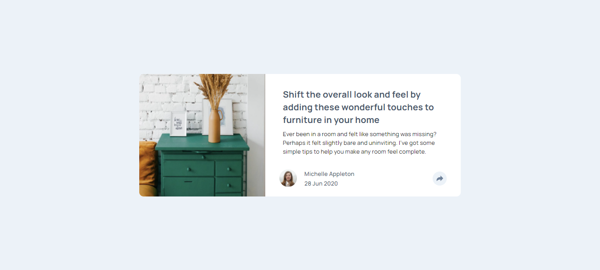
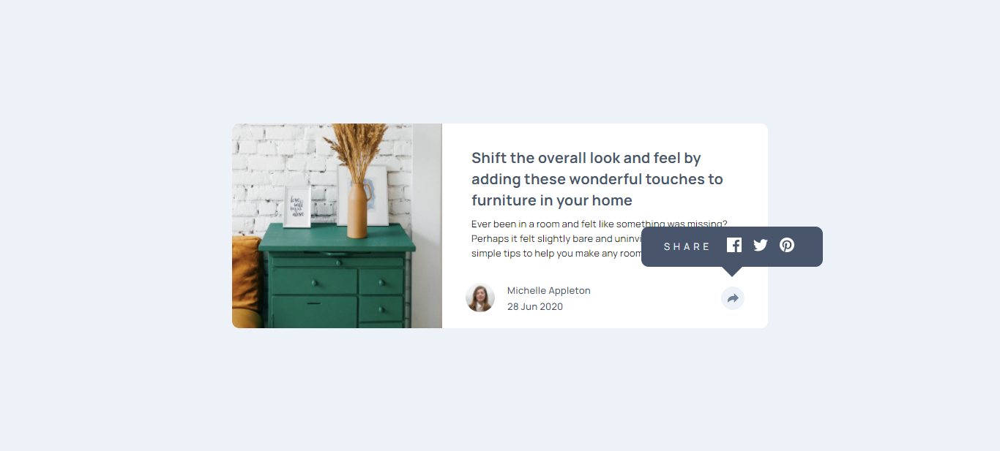
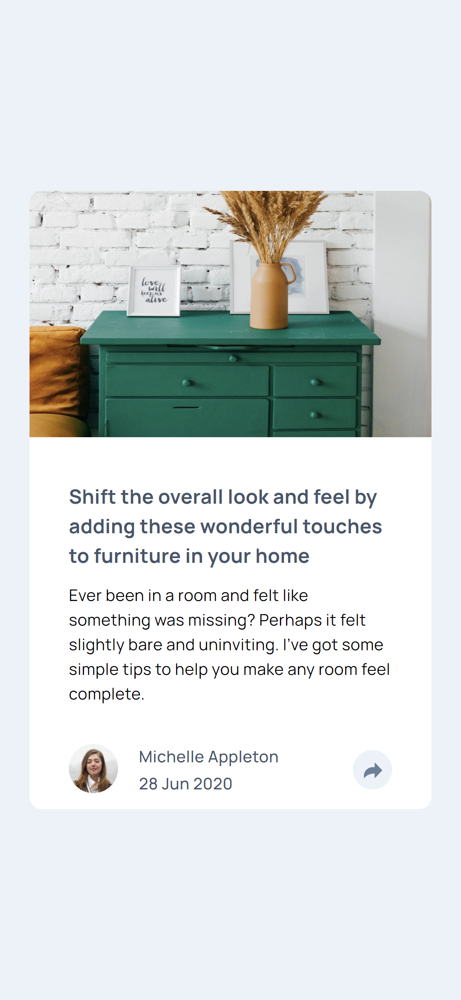
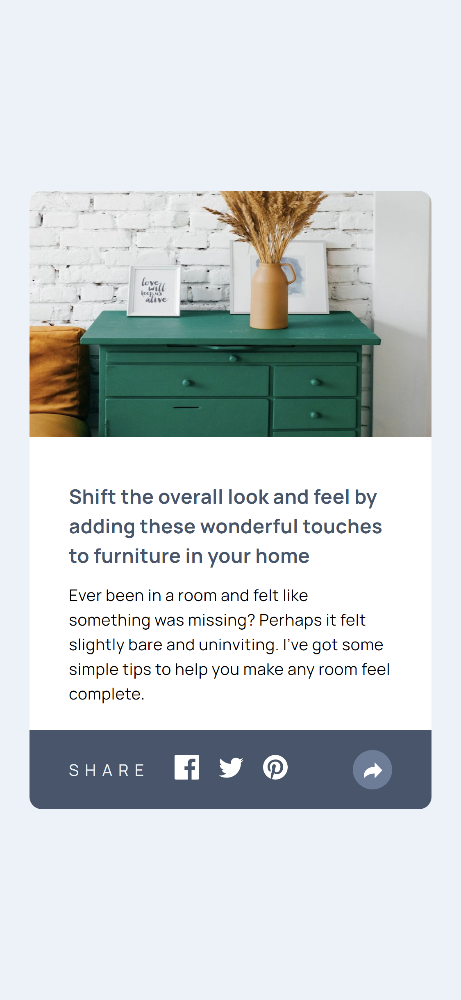

# Frontend Mentor - Article preview component solution

This is a solution to the [Article preview component challenge on Frontend Mentor](https://www.frontendmentor.io/challenges/article-preview-component-dYBN_pYFT). Frontend Mentor challenges help you improve your coding skills by building realistic projects. 

## Table of contents

- [Overview](#overview)
  - [The challenge](#the-challenge)
  - [Screenshot](#screenshot)
  - [Links](#links)
- [My process](#my-process)
  - [Built with](#built-with)
  - [What I learned](#what-i-learned)
  - [Continued development](#continued-development)
  - [Useful resources](#useful-resources)
- [Author](#author)

## Overview

### The challenge

Users should be able to:

- View the optimal layout for the component depending on their device's screen size
- See the social media share links when they click the share icon

### Screenshot

### Links

- Solution URL: (https://github.com/arbaiv/article-preview-component-challenge)
- Live Site URL: (https://focused-mccarthy-4f8978.netlify.app/)

## My process

### Built with

- Semantic HTML5 markup
- CSS custom properties
- Flexbox
- Mobile-first workflow

### What I learned

I learned how to copy the current url to the clipboard and how to make an element unclickable.

### Continued development

Need to build more projects.

### Useful resources

- [Resource 1](https://stackoverflow.com/questions/49618618/copy-current-url-to-clipboard) - I wanted to add an event to the #share-text element. So that when the link is clicked the url of the page will be copied to the clipboard.
- [Resource 2](https://developer.mozilla.org/en-US/docs/Web/CSS/pointer-events) - I had a bug where the share links section was clickable when it was not on the screen. It happened due to the animation I added. So, I used pointer-events property to make it unclickable when it's not visible.

## Author

- LinkedIn - [Abdur Rahaman](https://www.linkedin.com/in/abdur-rahaman-arb4/)
- Github - [@arbaiv](https://github.com/arbaiv)
- Twitter - [@arbaiv](https://twitter.com/arbaiv)
- Frontend Mentor - [@arbaiv](https://www.frontendmentor.io/profile/arbaiv)
